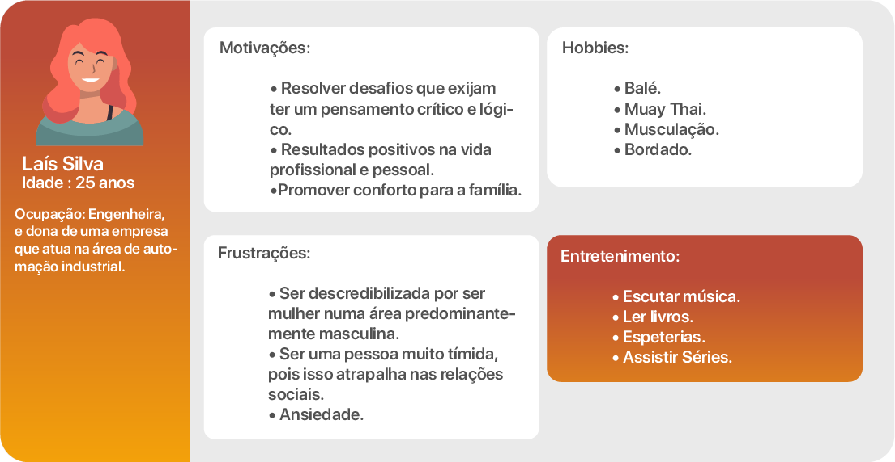
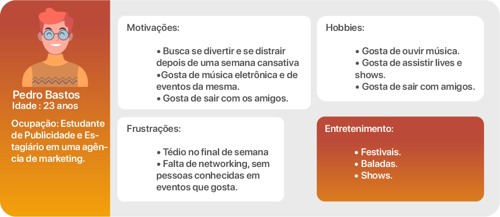
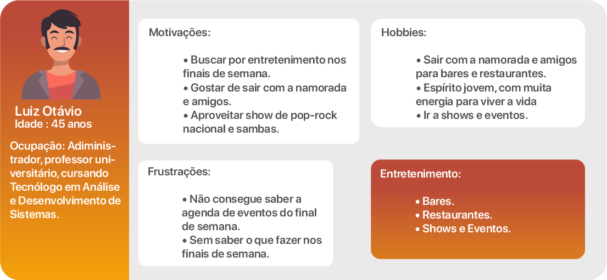
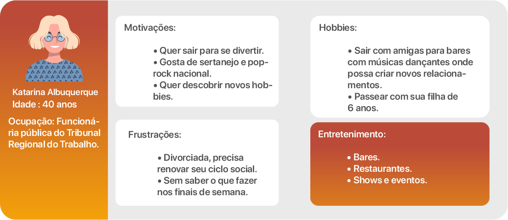
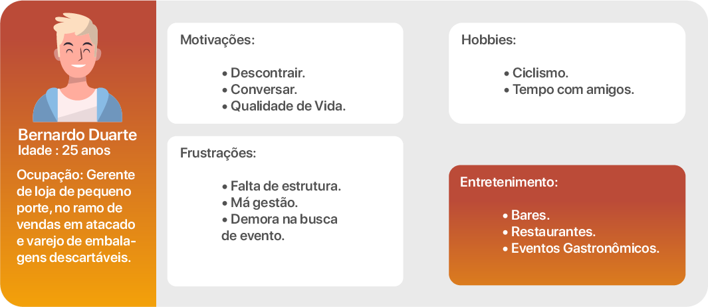

# Especificações do Projeto

A definição exata do problema e os pontos mais relevantes a serem tratados neste projeto foi consolidada com a participação dos usuários em um trabalho de imersão feita pelos membros da equipe a partir de entrevistas com potenciais usuários. Os detalhes levantados nesse processo foram consolidados na forma de personas e histórias de usuários.

## Personas

As personas levantadas durante o processo de entendimento do problema são apresentadas nas tabelas que se seguem.

## Histórias de Usuários

A partir da compreensão do dia a dia das personas identificadas para o projeto, foram registradas as seguintes histórias de usuários.

|EU COMO ... `PERSONA`|... QUERO/DESEJO ... `O QUE`|... PARA ... `POR QUE`|
|-|-|-|
|Isabella Diniz Baeta|encontrar facilmente locais que me despertam interesse|sair com minha família e amigos|
|Bernardo Duarte Diniz|Conhecer bares, restaurantes e eventos gratrônomicos|passar tempo com meus amigos|
|Pietra Laisy de Aquino Goulart|ir em festivais e boates|aproveitar a música e dançar|
|Luiz Otávio|sair com a namorada e amigos|divertir e aproveitar finais de semana|
|Katarina Albuquerque|sair com as amigas|criar novos relacionamentos|
|Laís Silva|conhecer pessoas novas|sair da rotina e me divertir|
|Pedro Bastos|sair com os amigos e aproveitar eventos de música eletrônica|distrair a mente e socializar|
|Henrique Gonçalves|vivenciar momentos alegres e divertidos com meus amigos|criar momentos que se eternizem na memória|

## Requisitos do Projeto

O escopo funcional do projeto é definido por meio dos requisitos funcionais que descrevem as possibilidades de interação dos usuários, bem como os requisitos não funcionais que descrevem os aspectos que o sistema deverá apresentar de maneira geral. Estes requisitos são apresentados a seguir.

### Requisitos Funcionais

A tabela a seguir apresenta os requisitos do projeto, identificando a prioridade em que os mesmos devem ser entregues.

|ID| Descrição do Requisito|Prioridade|
|-|-|-|
|RF-01|O site deve apresentar os principais eventos, shows e festas regionais na página principal|Alta|
|RF-02|O site deve apresentar informações sobre horário de início e término e local|Alta|
|RF-03|O site deve apresentar informações sobre o site |Alta|
|RF-04|O site deve permitir filtrar os eventos, shows e festas conforme o interesse do usuário (cidades / tipos de público / tipos de eventos, shows e festas)|Alta|
|RF-05|O site deve permitir que o usuário alterar entre imagens do evento |Média|
|RF-06|O site deve apresentar uma página de favoritos com cards que apresentam informações resumidas do evento. |Média|
|RF-07|O site deve possuir barra de navegação superior horizontal |Média|

### Requisitos não Funcionais

A tabela a seguir apresenta os requisitos não funcionais que o projeto deverá atender.

|ID| Descrição do Requisito|Prioridade|
|-|-|-|
|RNF-01|O site deve ser compatível com dispositivos móveis|Alta|
|RNF-02|O site deve ser leve e carregar rápido na tecnologia 4G|Alta|
|RNF-03|O site deve apresentar navegação fácil e intuitiva|Alta|
|RNF-04|O site deve ser compatível com os principais navegadores do mercado (Google Chrome, Microsoft Edge, Mozilla Firefox e Apple Safari)|Alta|
|RNF-05|O site deve armazenar os filtros aplicados anteriormente e aplica-los posteriomente|Média|

### Restrições

As questões que limitam a execução desse projeto e que se configuram como obrigações claras para o desenvolvimento do projeto em questão são apresentadas na tabela a seguir.

|ID| Descrição do Requisito|
|-|-|
|RE-01|O projeto deverá ser entregue até o final do semestre letivo com prazo limite na data 11/12/2022|
|RE-02|O site deverá utilizar apenas arquitetura Web Front-End|
|RE-03|O site deve realizar as funcionalidade propostas|
