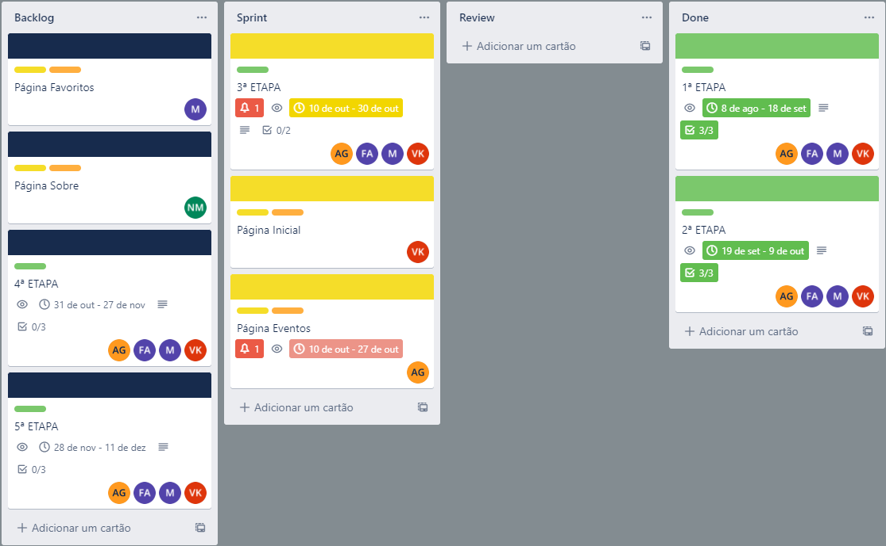

# Metodologia

A metodologia contempla as definições de ferramental utilizado pela equipe tanto para a manutenção dos códigos e demais artefatos quanto para a organização do time na execução das tarefas do projeto.

## Relação de Ambiente de Trabalho

Os artefatos do projeto são desenvolvidos a partir de diversas plataformas e a relação dos ambientes com seu respectivo propósito é apresentada na tabela que se segue.

|Ambiente|Plataforma|Link de Acesso|
|-|-|-|
|Repositório de Código Fonte|GitHub|[GitHub](https://github.com/ICEI-PUC-Minas-PMV-ADS/pmv-ads-2022-2-e1-proj-web-t6-grupo_3)|
|Documentos do Projeto|OneDrive|[Documentos do Projeto](https://sgapucminasbr-my.sharepoint.com/:f:/g/personal/1240910_sga_pucminas_br/EsJ1prDyw1hEovIHWUPI3agBZAltHo8TA16eT1vktokWtQ)|
|Projeto de Interface e Wireframes|Figma|[Desenvolvimento de Aplicação Web Front-End](https://www.figma.com/proto/kgK1Pwybvqa8zgG7ak3gpr/Desenvolvimento-de-Aplica%C3%A7%C3%A3o-Web-Front-End?node-id=1%3A2&scaling=min-zoom&page-id=0%3A1)|
|Gerenciamento do Projeto|Trello|[Desenvolvimento de Aplicação Web Front-End](https://trello.com/b/lV84StEK/desenvolvimento-de-aplica%C3%A7%C3%A3o-web-front-end)|

## Gerenciamento de Projeto

A equipe utiliza metodologia ágil, utilizando como base o modelo Scrum para definir o processo de desenvolvimento.

### Divisão de Papéis

A equipe está organizada da seguinte maneira:

- Scrum Master: Fernando Abreu
- Product Owner: Victor Kingma
- Equipe de Desenvolvimento:
  - Alexsander Goulart
  - Fernando Abreu
  - Florisvaldo Neto
  - Matheus Leão
  - Victor Kingma

### Processo

Para organização e distribuição das tarefas do projeto, a equipe está utilizando o Trello. Sendo estruturado da seguinte forma:

- Backlog
- Sprint
- Review
- Done

