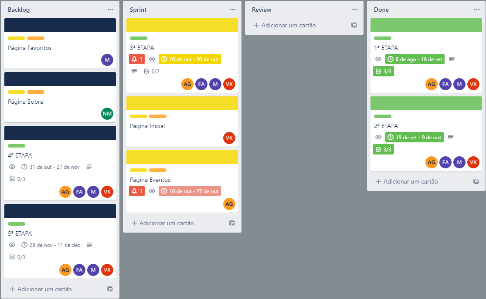
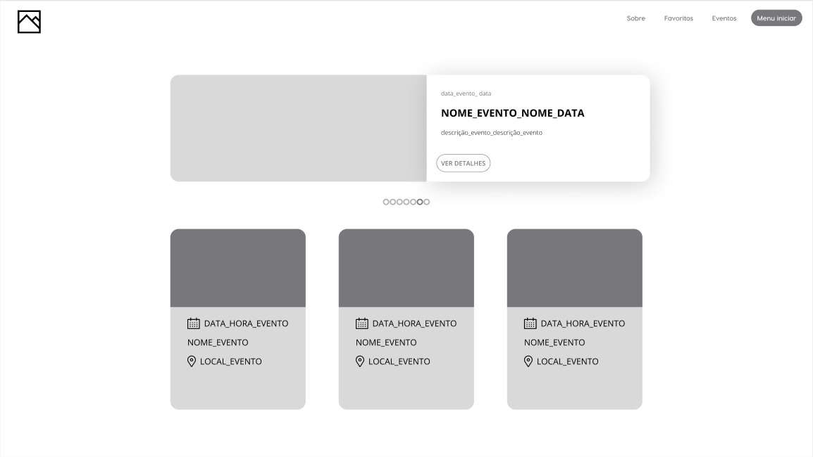
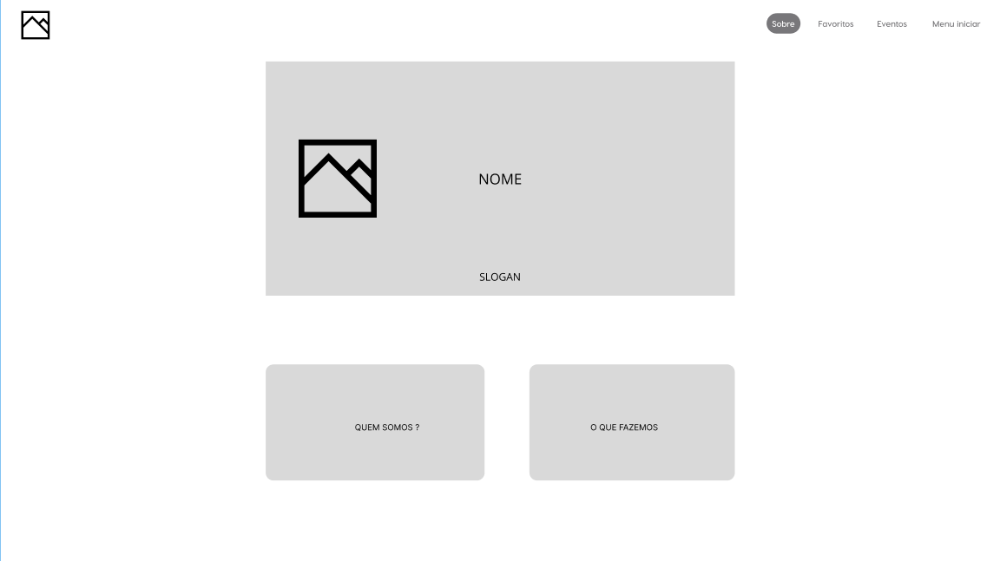

# Projeto de Interface

Dentre as preocupações para a montagem da interface do sistema, estamos estabelecendo foco em questões como agilidade, acessibilidade e usabilidade. Desta forma, o projeto tem uma identidade visual padronizada em todas as telas que são projetadas para funcionamento em desktops e dispositivos móveis.

## Fluxo do Usuário

O diagrama apresentado na Figura 2 mostra o fluxo de interação do usuário pelas telas do sistema. Cada uma das telas deste fluxo é detalhada na seção de Wireframes que se segue. Para visualizar o Wireframe interativo, acesse o ambiente Figma do projeto.

## Wireframes

Conforme fluxo de telas do projeto, apresentado no item anterior, as telas do sistema são apresentadas nos itens que se seguem.

### Tela - Página Inicial

A página inicial mostra eventos de destaque e os demais eventos a partir dos dados inseridos do sistema.

### Tela - Evento

A tela evento mostra as informações completas do evento, tais como: nome, data, horário, endereço, descrição, contato oficial, etc.

### Tela - Favoritos

A tela de favoritos apresenta os cards dos eventos que o usuário havia marcado previamente.

### Tela - Sobre

A tela sobre apresenta melhor o que é a plataforma e o que ela faz (de qual forma, com qual objetivo e porquê).

