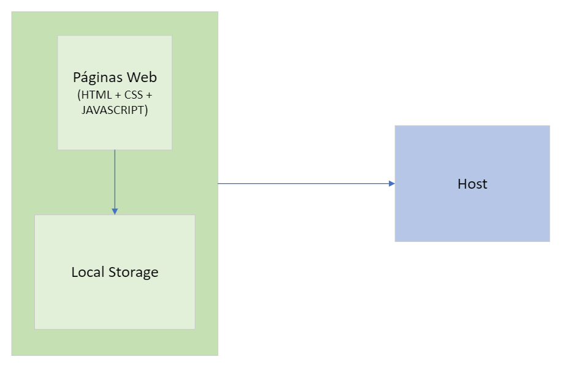

# Arquitetura da Solução

Nesta seção são apresentados os detalhes técnicos da solução criada pela equipe, tratando dos componentes que fazem parte da solução e do ambiente de hospedagem da solução.

## Diagrama de componentes

Os componentes que fazem parte da solução são apresentados na figura que se segue.

A solução implementada conta com os seguintes módulos:

<ul>
<li>Navegador - Interface básica do sistema</li>
<li>Páginas Web - Conjunto de arquivos HTML, CSS, JavaScript e imagens que implementam as funcionalidades do sistema.</li>
<li>Local Storage - armazenamento mantido no Navegador, onde são implementados bancos de dados baseados em JSON. São eles:
<ul>
<li>Tela inicial - seções com os eventos apresentados</li>
<li>Eventos – evento detalhado</li>
<li>Favoritos - lista de eventos mantidos para leitura e acesso posterior</li>
<li>Sobre - comentário sobre a plataforma e o que ela oferece</li>
</ul>
</li>
<li>Hospedagem - local na Internet onde as páginas são mantidas e acessadas pelo navegador.</li>
</ul>

## Hospedagem

O site utiliza hospedagem dedicada.