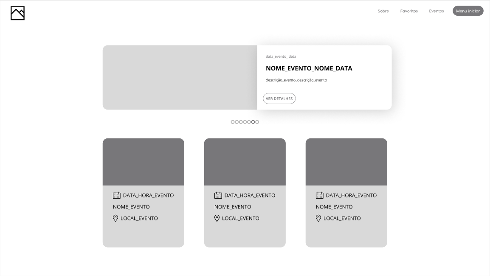
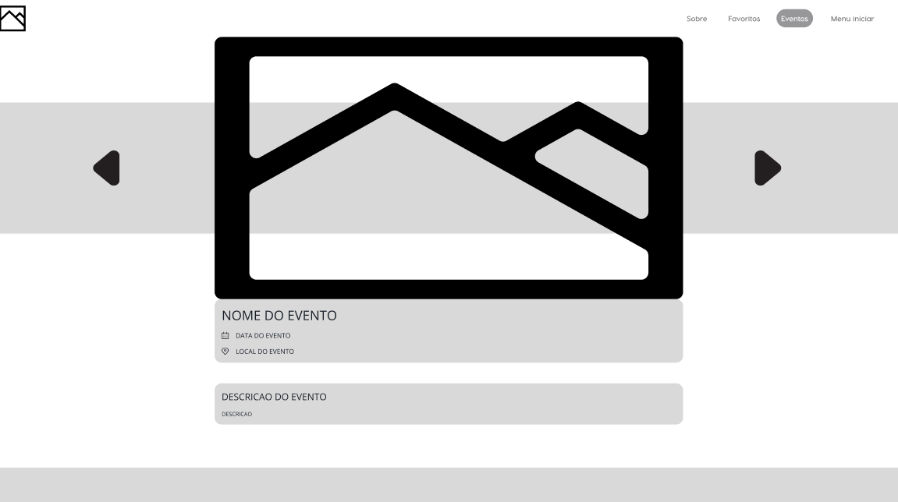
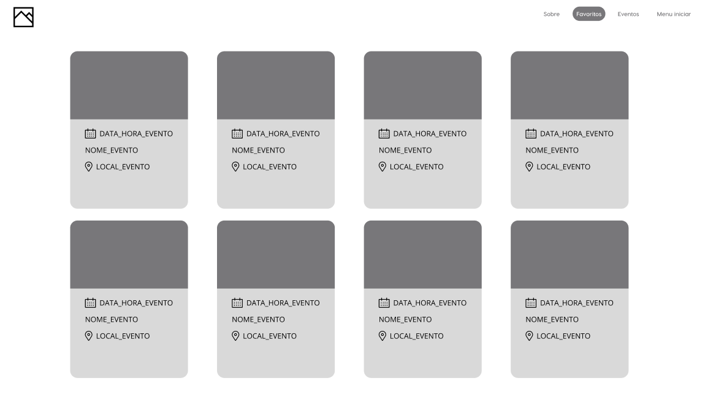
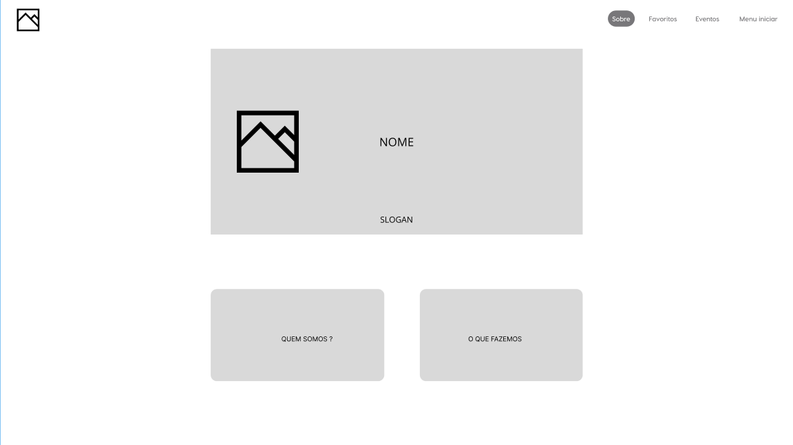

# Template padrão do site

O padrão de layout a ser utilizado pelo site tem correspondência ao projeto de Interface elaborado anteriormente, conforme Figura X.

O template criado está disponível no [Figma](https://www.figma.com/proto/kgK1Pwybvqa8zgG7ak3gpr/Desenvolvimento-de-Aplica%C3%A7%C3%A3o-Web-Front-End?node-id=1%3A2&scaling=min-zoom&page-id=0%3A1) e é composto pelos seguintes layouts:

<ul>
<li>Página Inicial</li>
<li>Eventos</li>
<li>Favoritos</li>
<li>Sobre</li>
</ul>

## Página Inicial

Tela que abrange todas as visualizações iniciais do site e a lista de eventos gerais

## Eventos

Este layout é utilizado para exibição do evento selecionado pelo usuário.

## Favoritos

Local onde são exibidos os eventos marcados como favoritos pelo usuário.

## Sobre

Neste local são apresentadas informações sobre o propósito do site.

