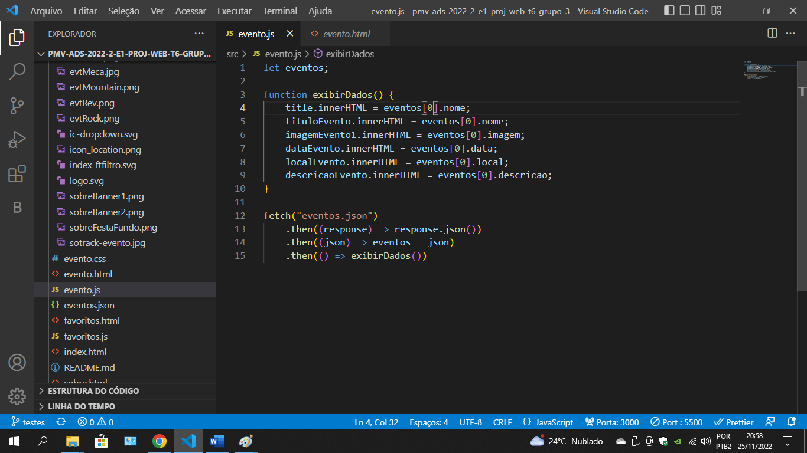
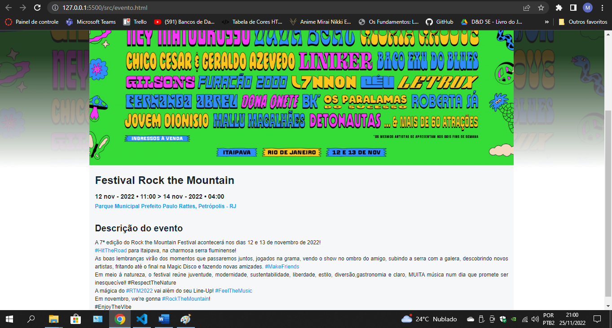
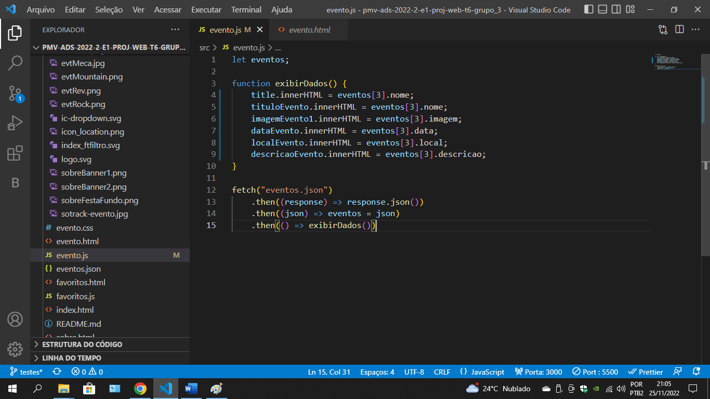
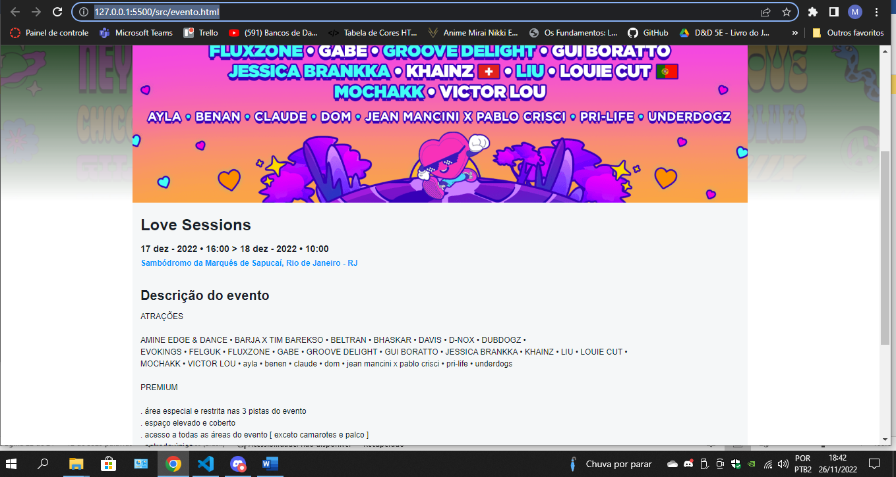

# Registro de Testes de Software
<!--
Pré-requisitos: <a href="3-Projeto de Interface.md"> Projeto de Interface</a>, <a href="8-Plano de Testes de Software.md"> Plano de Testes de Software</a>

Relatório com as evidências dos testes de software realizados no sistema pela equipe, baseado em um plano de testes pré-definido.

## Avaliação

Discorra sobre os resultados do teste. Ressaltando pontos fortes e fracos identificados na solução. Comente como o grupo pretende atacar esses pontos nas próximas iterações. Apresente as falhas detectadas e as melhorias geradas a partir dos resultados obtidos nos testes.

> **Links Úteis**:
> - [Ferramentas de Test para Java Script](https://geekflare.com/javascript-unit-testing/) -->

CT-01:

Teste: Foi testado no código JavaScript, o comportamento da página "Eventos" quando utilizados diferentes índices do arquivo JSON:  
Conclusão: O site se comportou como esperado ao realizar os testes. A página carregará diferentes eventos, conforme a solicitação.  

Índice 0:  
 
  

Índice 1:  
 
  

Índice 3:  
 

