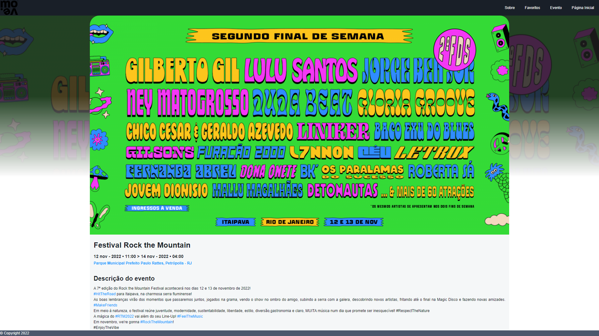

# Registro de Testes de Software

CT-01:

Teste: Foi testado no código JavaScript, o comportamento da página "Eventos" quando utilizados diferentes índices do arquivo JSON:  
Conclusão: O site se comportou como esperado ao realizar os testes. A página carregará diferentes eventos, conforme a solicitação.  

Índice 1:  
  

Índice 2:  
  

Índice 4:  
